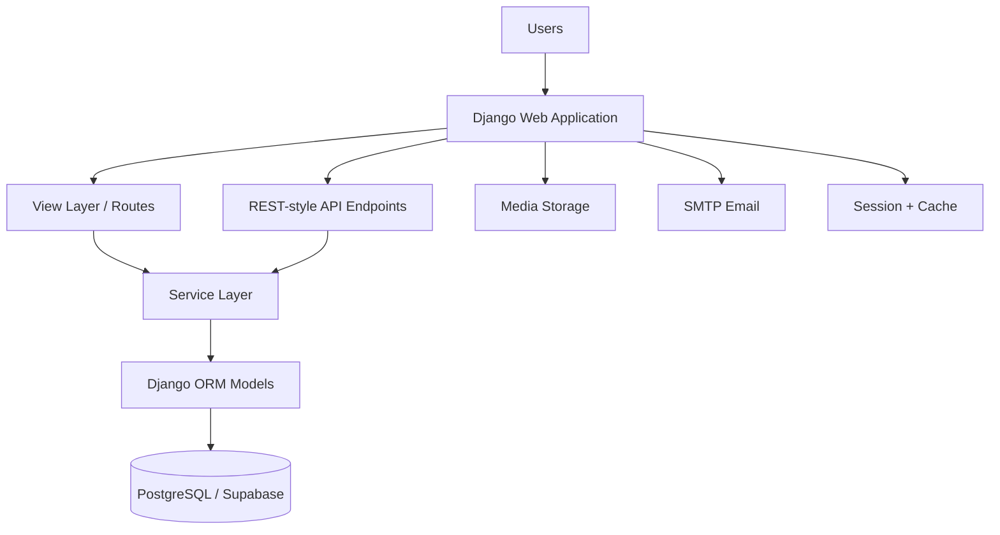

# ACT HRMS — Architecture and System Design

## 1. Executive Summary

This repository implements an enterprise-grade Human Resource Management System as a Django monolithic web application. The codebase is organized around a central `hr` application and a PostgreSQL-backed domain model. The system supports employee administration, attendance capture, QR-based kiosk tracking, leave approvals, payroll, performance KPI management, recruitment, grievance workflows, dashboards for HR, supervisor, dean, and CEO roles, and reporting.

The architecture is best understood as a layered monolith:

- Presentation layer: Django routes, templates, and HTML/API endpoints
- Application layer: view handlers and service orchestration
- Domain layer: Django ORM models representing employees, attendance, leave, payroll, reports, recruitment, grievances, and audit entities
- Infrastructure layer: PostgreSQL, media storage, SMTP email, sessions, cache, and QR-attendance integration

---

## 2. System Context

### Primary Users

- Employees
- HR staff
- Supervisors
- Dean / institutional leadership
- CEO / President
- Public applicants for career openings

### Main Functional Areas

1. Employee lifecycle management
2. Attendance and QR-based scan tracking
3. Leave request and leave approval workflows
4. Payroll and salary slip retrieval
5. KPI/performance and training workflows
6. Recruitment and application processing
7. Grievance and disciplinary handling
8. Dashboard analytics and CSV/PDF export

---

## 3. High-Level Architecture

### Architectural Style

This is a monolithic Django architecture, rather than a distributed SaaS architecture. The same project contains:

- routing
- authentication and session handling
- permission rules
- form handling
- business service orchestration
- reporting and dashboard generation
- persistence access through the ORM

This leads to a simpler deployment model and lower operational overhead, but it also means that the app depends heavily on code organization and discipline to keep business rules maintainable.

---

## 4. Layered Design Map

### 4.1 Presentation Layer

Responsible for user interaction and request entry.

Primary entry points:

- Project root routing: `humanresource/urls.py`
- App routing: `hr/urls.py`

Examples of exposed user entry points:

- public login and logout
- employee dashboard
- HR dashboard
- dean dashboard
- CEO dashboard
- supervisor dashboard
- kiosk and tablet attendance flows
- public careers page and application submission

This layer includes page views and JSON endpoints for front-end interactions.

### 4.2 Application Layer

This layer coordinates use cases and business flow decisions.

Examples include:

- `api_views.py` for SPA/API-oriented operations
- `attendance_views.py` for attendance logs, live dashboards, and QR scan handling
- `leave_views.py` for employee and HR leave actions
- `dashboard_views.py` for dean and CEO analytics and export actions
- `recruitment_views.py` for career application and hiring workflow
- `hr_modules_views.py` for HR module pages like payroll, training, general settings, and reports

This layer is where request validation, role enforcement, data retrieval, status updates, and redirects happen.

### 4.3 Domain Layer

The domain layer is represented by the rich ORM model layer in `hr/models.py`.

Core domain entities include:

- `Employee`
- `Attendance`
- `LeaveRequest`
- `LeaveBalance`
- `Department`
- `Position`
- `Payroll`
- `Salary`
- `PerformanceEvaluation`
- `KPIIndicator`
- `TrainingRequest`
- `Grievance`
- `DisciplinaryRecord`
- `Application`
- `JobPosting`
- `AuditLog`

These classes model the real business concepts the application serves.

### 4.4 Infrastructure Layer

This layer handles cross-cutting concerns and external service integration.

Key infrastructure components:

- PostgreSQL / Supabase persistence
- Django session management
- local in-memory cache or configurable cache backend
- file/media storage for signatures, IDs, photos, certificates
- SMTP-based email delivery for password setup and notifications
- QR-token-based attendance scan workflows

---

## 5. Request Flow Examples

### 5.1 Employee Attendance Flow

1. Employee opens the attendance or QR page.
2. Request enters through Django URL routing.
3. The attendance view resolves the employee from the session or QR token.
4. The view delegates the workflow to attendance service functions.
5. Attendance is created or updated in the `Attendance` table.
6. The `calculate_status()` logic derives the attendance status.
7. The UI or response returns the result to the employee/HR user.

### 5.2 Leave Request Flow

1. Employee submits leave request details.
2. `employee_leave_manager()` validates request input.
3. The request is passed to `leave_service.submit_leave_request()`.
4. Leave service validates the data and creates a `LeaveRequest` record.
5. `LeaveRequest.status` remains in a workflow state such as `Pending`, `Approved`, or `Rejected`.
6. HR or an approver uses the approvals page to transition the request.
7. Audit/history persistence keeps a full lifecycle trail.

### 5.3 Recruitment to Onboarding Flow

1. Applicant submits a public application form.
2. The application is stored as an `Application` record.
3. HR reviews and changes the application status in the recruitment dashboard.
4. When the application reaches a final hiring status, the system converts it into an `Employee` profile via `convert_application_to_employee()`.
5. A user identity is generated or reused, credentials are prepared, and an email can be sent to the new employee.

---

## 6. Core Domain Data Model

The domain model follows a relational database design using Django ORM. Some notable patterns:

- `BaseModel` adds soft-delete behavior through `is_deleted` and `deleted_at`.
- `ActiveManager` makes the default ORM queryset return only active, non-deleted rows.
- `SystemSetting` stores configuration and feature toggles by category/key.
- `Employee` is the center of most workflows and includes role, department, position, status, QR token, signature, and photo metadata.
- `Attendance` stores per-day in/out timestamps and status.
- `LeaveRequest` and `LeaveBalance` support leave entitlement and approval logic.
- `Application`, `Applicant`, and `JobPosting` support external candidate hiring workflows.
- `AuditLog` and `Report` support compliance, governance, and analytics.

This indicates the app favors a single shared domain schema rather than a heterogeneous event-driven architecture.

---

## 7. Workflow Engine Description

### 7.1 What “workflow engine” means in this codebase

There is not a standalone BPM workflow-engine library or separate workflow microservice in this repository. Instead, the actual workflow engine is a blend of:

- Django URL routing
- view functions as workflow entry points
- service classes/functions for orchestration
- model state fields such as `status`, `is_deleted`, and related approval states
- role-based gating and redirect logic
- audit-friendly persistence

In practical terms, the “workflow engine” is implemented as a server-side orchestration pattern around business objects and their state transitions.

### 7.2 Engine Pattern

The application uses a simple but effective workflow engine structure:

1. Receive request
2. Validate input / authorize user
3. Resolve target domain object
4. Route to business service
5. Apply state transition rules
6. Persist new state
7. Trigger notifications or UI messages
8. Return page/API response

### 7.3 Workflow Examples

#### a) Leave Workflow

State progression:

- `Pending` → submitted by employee
- `Approved` → HR approves
- `Rejected` → HR rejects
- `Cancelled` → employee cancels while still pending

Implementation style:

- UI page collects leave request data
- `leave_service.submit_leave_request()` validates the request
- `leave_service.approve_request()` or `leave_service.reject_request()` updates the record
- status is stored on the `LeaveRequest` model and reflected in HR pages

#### b) Attendance Workflow

Attendance is a per-day operational workflow where the main rule is:

- first scan of the day opens a record
- second scan closes the record
- `calculate_status()` derives final status such as `Present`, `Late`, or `Absent`

This is a transaction-based workflow rather than a separate workflow engine engine.

#### c) Recruitment Workflow

The recruitment workflow is the clearest example of a state-driven engine.

Typical progression:

- application submitted
- HR reviews / updates status
- selected or hired state triggers employee conversion
- converted employee record is generated with credentials and onboarding email signaling

This is implemented through view-driven status changes plus a conversion function that materializes the employee domain object.

### 7.4 Why this works well here

This approach suits the project because the business rules are fairly tightly coupled to Django models and pages. The team avoided introducing a heavy process engine, which keeps the app lightweight and easy to deploy.

### 7.5 Limitations of the Current Workflow Model

The current implementation is strong for CRUD-style and state-based business workflows, but it is not a full enterprise workflow engine with:

- BPMN modeling
- code-free workflow definition
- asynchronous event streams
- durable workflow orchestration across services
- versioned process definitions

If the app grows to require rich workflow automation, the next evolution would be to extract these transitions into a formal workflow service, domain service layer, and state machine definitions.

---

## 8. Security and Access Design

The config in `settings.py` shows strong baseline controls:

- Django authentication and session middleware
- CSRF protection
- password validation policy
- session expiration and parallel login safety posture
- admin and HR access separation
- API throttling controls for public scanner endpoints

The app uses the role model and the employee relationship to gate views and dashboards by capability.

---

## 9. Data and Integration Dependencies

### Persistence

- `PostgreSQL` via Supabase connection settings
- `django.db.backends.postgresql`

### File Handling

- employee photos
- signatures
- identity files
- certificates

### Notifications

- SMTP via Gmail app password setting
- email fallbacks for user setup and password reset workflows

### Caching

- default local in-memory cache for development
- can be swapped to external cache services in production

---

## 10. Deployment and Runtime Model

This project is designed to run as a single standard Django web application with:

- one environment configuration
- one database
- one ORM schema
- one codebase

That makes it ideal for a straightforward deployment to a web server or container runtime, with a separate PostgreSQL provider.

---

## 11. Architectural Evaluation

### Strengths

- simple deployment model
- clear route-to-view-to-model pattern
- role-based dashboards and access model
- strong domain coverage for HR use cases
- integrated front-end APIs and page-based UX

### Challenges

- workflow logic is spread across views and services
- domain logic is highly coupled to Django request handling
- long-term maintainability would improve with a more explicit service layer and state-machine model
- business rules may become difficult to evolve without refactoring into more encapsulated application services

---

## 12. Recommended Future Refactor Direction

To evolve toward a cleaner architecture, the next step would be:

1. Keep Django as the web framework and ORM.
2. Introduce explicit service-oriented modules for each domain workflow.
3. Move transition logic into small state-machine style service functions.
4. Put role-specific policy checks in dedicated policy classes.
5. Keep views as thin controllers that delegate to services.
6. Add workflow event tracing so every status change is auditable.

This would preserve the current monolith, while making the workflow engine more explicit, predictable, and scalable.
